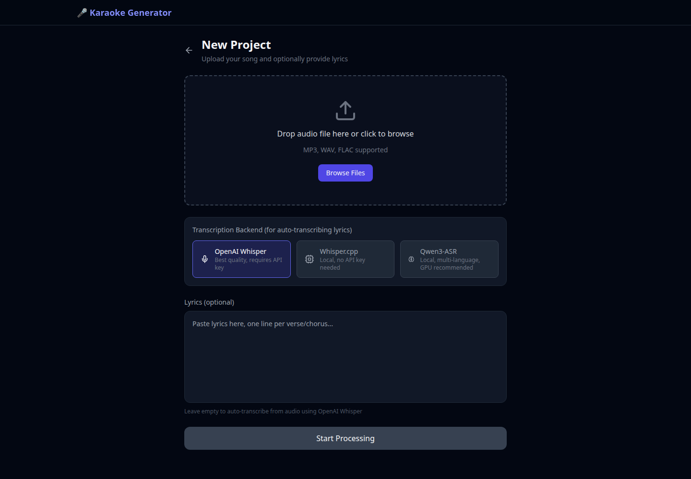
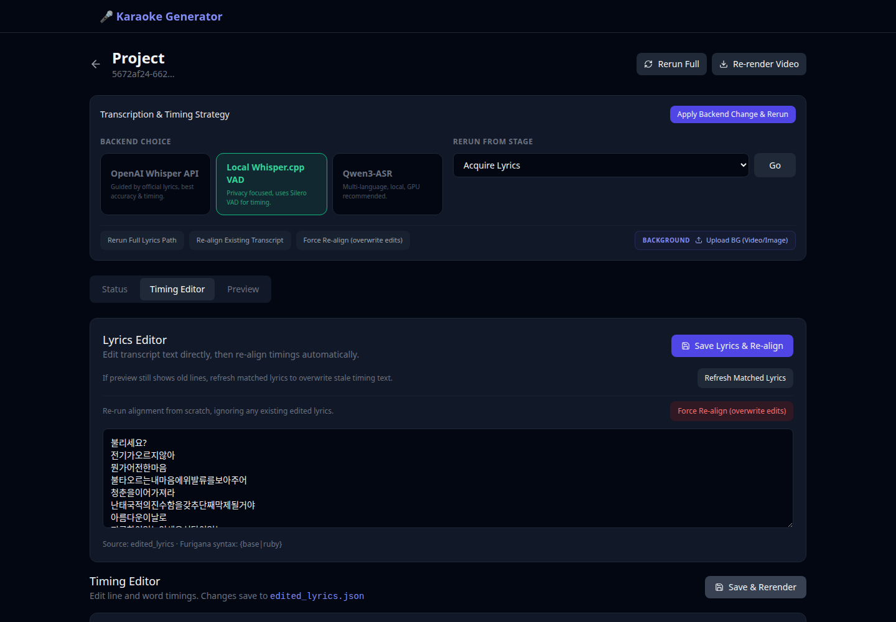
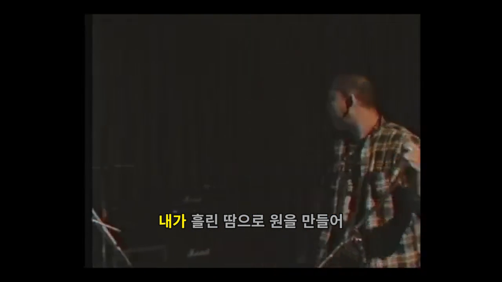

# Karaoke Video Generator

Turn a song into an editable, word-timed karaoke video from a local web application.

The application separates vocals, transcribes and aligns lyrics, extracts the vocal melody, and renders a 720p MP4 with animated karaoke highlighting. The generated timing remains editable: lines and words can be corrected, nudged, locked, or tapped in against the vocal track before rerendering.

## From audio to finished video

| 1. Upload and choose an ASR backend | 2. Review lyrics and timing | 3. Render the karaoke video |
| --- | --- | --- |
|  |  |  |

## What works

- Complete browser workflow for uploading audio, monitoring six processing stages, editing timing, previewing the result, and downloading MP4, MIDI, and timing JSON artifacts.
- BS-RoFormer vocal/instrumental separation through UVR model weights, with chunked overlap-add inference, ROCm memory cleanup, and automatic lower-memory retries.
- Three transcription paths: OpenAI Whisper, local Whisper.cpp with optional Silero VAD, and local Qwen3-ASR with English, Japanese, Korean, Mandarin, and Cantonese support.
- Editable line- and word-level alignment. The UI includes tap-to-time, global and per-item nudging, line locks, overlap warnings, lyrics replacement and realignment, and separate `display_start` / `sing_start` controls.
- TorchCrepe F0 extraction, MIDI export, synthesized melody guidance, optional pitch dots, and editable melody exclusion zones.
- FFmpeg/ASS video rendering with per-word highlighting, countdowns, next-line lead time, furigana, song metadata, and custom image or looping-video backgrounds.
- Resumable filesystem-backed projects. Completed stages are cached, and a rerun can start from any selected stage without a database, queue, or cloud runtime.

## Pipeline

```text
audio upload
    -> normalize audio
    -> separate vocals / instrumental (BS-RoFormer)
    -> acquire lyrics (provided text or ASR)
    -> align lines and words
    -> extract F0 and write MIDI
    -> render ASS + melody guide + MP4
    -> edit timing and rerender
```

Each project keeps its inputs, state, intermediate artifacts, edits, and renders under `data/projects/{project_id}`. `edited_lyrics.json` is the source of truth after a manual edit, so model output is preserved separately from user corrections.

## Reference performance

A recorded end-to-end run for a 3:25 source track completed in **10m 42s** on an **AMD Ryzen AI Max+ Pro 395 with Radeon 8060S (Strix Halo)** using the balanced BS-RoFormer preset and local Whisper.cpp transcription.

| Stage | Time |
| --- | ---: |
| Normalize audio | 0.2s |
| BS-RoFormer stem separation | 7m 49s |
| Whisper.cpp transcription | 1m 52s |
| Lyric alignment | 0.2s |
| Melody extraction + MIDI | 50s |
| 720p video render | 10s |

Measured on April 22, 2026 from the stage timestamps persisted in `project.json`; no lyrics were supplied. Runtime varies with track length, model choice, chunk preset, and available GPU memory.

## Run locally

### Requirements

- Python 3.12
- Node.js 20+
- FFmpeg and FFprobe
- A supported transcription backend
- BS-RoFormer checkpoint, YAML configuration, and a compatible UVR checkout for real stem separation

ROCm is optional, but strongly recommended for BS-RoFormer, Qwen3-ASR, and TorchCrepe acceleration on AMD hardware.

### 1. Install the backend

```bash
python3.12 -m venv .venv
source .venv/bin/activate
pip install -r requirements.txt
cp .env.example .env
```

Configure at least one transcription backend in `.env`:

```dotenv
# Cloud transcription
OPENAI_API_KEY=...

# or local Whisper.cpp
WHISPER_CPP_BIN=/path/to/whisper-cli
WHISPER_CPP_MODEL=/path/to/ggml-model.bin
WHISPER_CPP_VAD_MODEL=/path/to/ggml-silero-vad.bin

# or local Qwen3-ASR
QWEN_ASR_MODEL_PATH=/path/to/Qwen3-ASR-1.7B
QWEN_ASR_FORCED_ALIGNER_PATH=/path/to/Qwen3-ForcedAligner-0.6B
```

For AMD ROCm 7.2.1, `scripts/install_rocm721_torch.sh` installs the pinned PyTorch wheel set used by this project.

### 2. Configure BS-RoFormer

Point the adapter at the UVR repository and model assets:

```dotenv
UVR_REPO_PATH=/path/to/ultimatevocalremovergui
UVR_BSROFORMER_CKPT=/path/to/model_bs_roformer.ckpt
UVR_BSROFORMER_YAML=/path/to/model_bs_roformer.yaml
BSROFORMER_SPEED_PRESET=balanced
```

Available presets are `fast`, `balanced`, `quality`, and `safe`. If these assets are absent or the UVR module cannot be imported, the adapter enters a fail-soft development mode and copies the mix to both stem outputs so the remaining workflow can still be exercised. That mode does **not** remove vocals; verify the model paths before evaluating output quality.

### 3. Start the API and web application

```bash
# Terminal 1, from the repository root
source .venv/bin/activate
bash scripts/run_api.sh

# Terminal 2
cd apps/web
npm install
npm run dev
```

Open `http://localhost:5173`. The API is available at `http://127.0.0.1:8000`, with interactive documentation at `http://127.0.0.1:8000/docs` and a health check at `http://127.0.0.1:8000/health`.

## Project structure

| Path | Responsibility |
| --- | --- |
| `apps/web` | React, TypeScript, Vite, Tailwind, and TanStack Query UI |
| `services/api` | FastAPI routes, schemas, project store, and pipeline service |
| `services/engine` | ASR, alignment, separation, pitch extraction, and rendering |
| `libs/contracts` | OpenAPI and timing JSON contracts |
| `docs/architecture.md` | System design and project artifact layout |
| `docs/api.md` | API endpoint summary |

See [`apps/web/README.md`](apps/web/README.md) for frontend-specific development notes.
