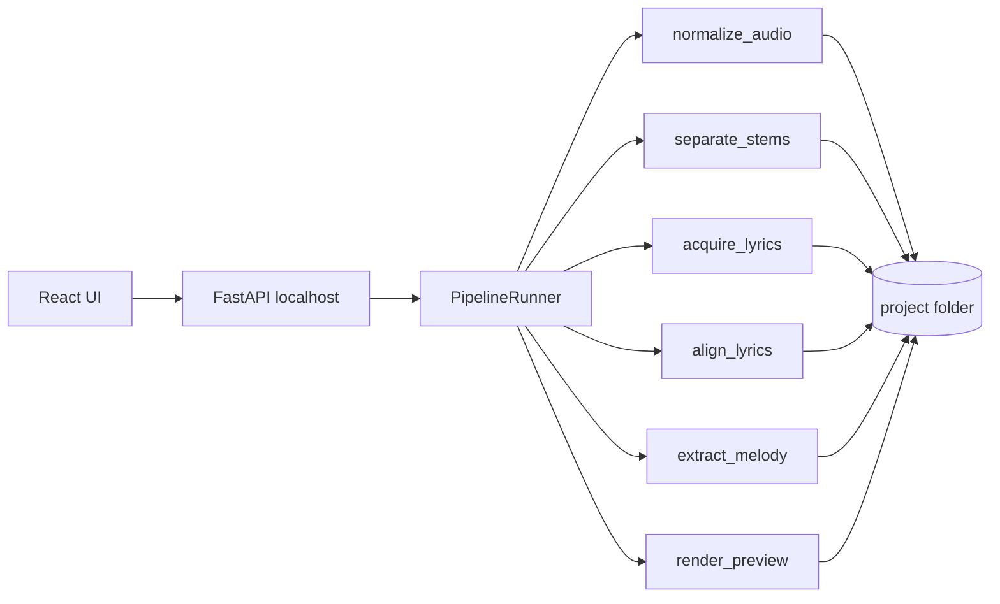

# Local-First System Design



## Design Choices

- No queue, DB, or cloud dependencies.
- One local project folder per song holds all artifacts and state JSON.
- Pipeline runs stage-by-stage with resumable caching.
- `aligned_lyrics.json` stores model output; `edited_lyrics.json` stores user corrections.
- Timing JSON is source of truth for preview and final rendering.

## Project Folder Contract

```text
data/projects/{project_id}/
  input/
    song.*
    normalized.wav
    lyrics.txt
  stems/
    vocals.wav
    instrumental.wav
  transcript/
    raw_transcript.json
    aligned_lyrics.json
    edited_lyrics.json
  melody/
    f0.json
    melody.mid
  render/
    preview.ass
    preview.mp4
    final.mp4
  project.json
```
